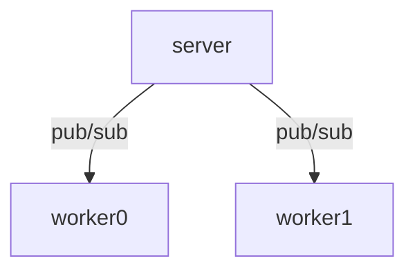

# Basic publish / subscribe partner with github.com/zeromq/goczmq v4

This project is an example of implementation the notorious pub/sub using [https://github.com/zeromq/goczmq]



Commands

To install
```
git clone git@github.com:jvmvik/czmq_pub_sub_example.git
cd czmq_pub_sub_example
go mod tidy
```

To create 3 terminal.

Terminal 1 + 2 runs 2 workers as subscriber
```
cd worker
go run worker.go
```

Terminal 3 runs the server as publisher
```
go run server.go  
```

Tested with 
 - Go 1.19
 - AWS graviton2 (arm64) running Debian 11