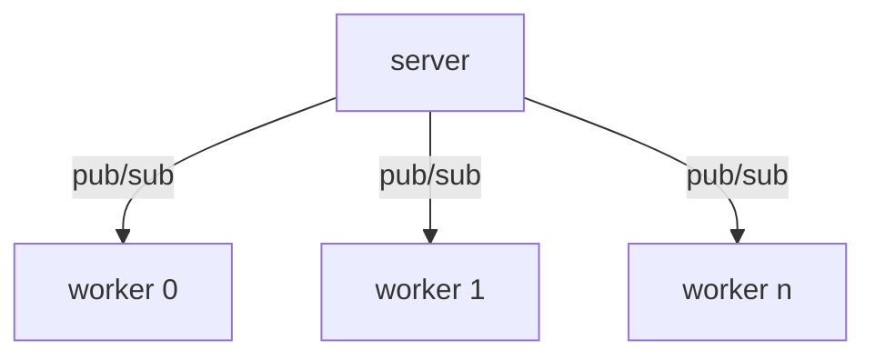

# Basic publish / subscribe partner with github.com/zeromq/goczmq v4

This project is an example of implementation the notorious pub/sub using [https://github.com/zeromq/goczmq]



### Why ?
I was blocked for many hours around 3 limitations.

The publish failed to bind the socket right away. 
A sleep delay must be included before sending the first message or the message is dropped.

There is zero documentation around how the topic works.
I had to reverse engineer an unrelated test and code to figure out what do to.

The socket communication doesn't feel stable during my experimentation.
I randomly see corrupted messages on the publisher or the subscriber side.

### Commands

To install
```bash
git clone git@github.com:jvmvik/czmq_pub_sub_example.git
cd czmq_pub_sub_example
go mod tidy
```

To create 3 terminal.

Terminal 1 + 2 runs 2 workers as subscriber
```bash
cd worker
go run worker.go
```

Terminal 3 runs the server as publisher
```bash
go run server.go  
```

Tested with:
 - Go 1.19
 - AWS graviton2 (arm64) running Debian 11

